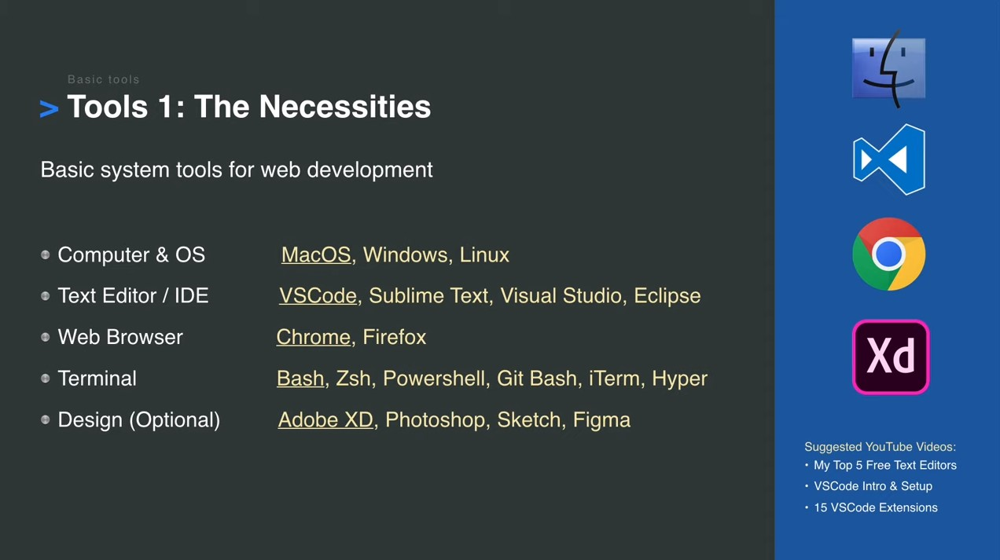
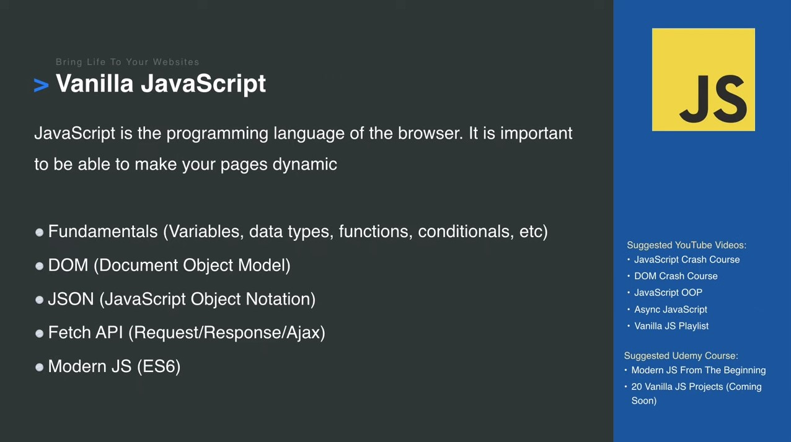
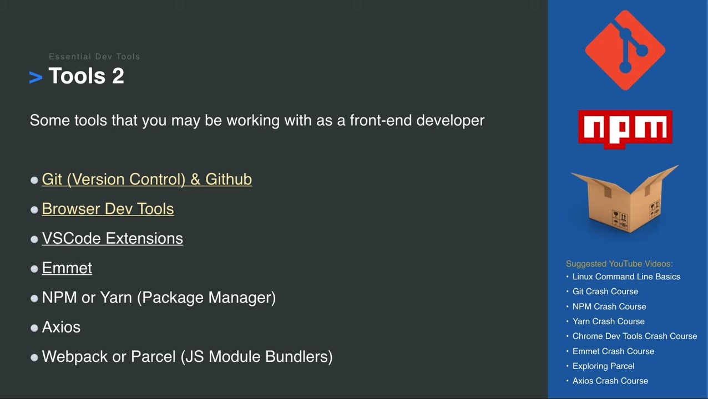

# Web Development In 2020 - A Practical Guide Courses
It's that time of year again, and Brad Traversy has released his Web Development roadmap for the upcoming year. It is a fantastic resource that I know we are all thankful for. And being a web developer has never been better, and as shown in the video there are a **TON** of technologies at our disposal! But, that can also be rather intimidating for newcomers. So I have comprised a list below of the top Udemy courses for each slide as well for other resources as much as possible. They will listed just in alphabetical order for simplicity. From here, it really is up to you what you want to learn. 

And as Brad mentions in the video, you certainly **DO NOT** need to learn everything here. He is just providing you with the options of what you *CAN* learn (and somethings you *SHOULD* learn, such as HTML, CSS, and JavaScript), and explains what these technologies are.

Watch the [video here](https://www.youtube.com/watch?v=0pThnRneDjw).

And of course there are other learning platforms besides Udemy, but that is the platform I am personally most familiar and I think is the most popular, so that's what I am going with. So withour further ado, let's get learning!

## Tools 1 - The Necessities

### Computer & OS
- MacOS
- Windows
- Linux

### Text Editor / IDE
+ [Atom](https://atom.io/)
+ [Brackets](http://brackets.io/)
+ [Sublime Text](https://www.sublimetext.com/)
+ [Visual Studio Code](https://code.visualstudio.com/)

### Browser
+ [Chrome](https://www.google.com/chrome/)
+ [Firefox](https://www.mozilla.org/en-CA/firefox/)
+ [Opera](https://www.opera.com/)

### Design
+ [Adobe Illustrator](https://www.adobe.com/ca/products/illustrator.html)
+ [Adobe Photoshop](https://www.photoshop.com/)
+ [Adobe XD](https://www.adobe.com/ca/products/xd.html)
+ [Affinity](https://affinity.serif.com)
+ [Figma](https://www.figma.com/)
+ [InVision](https://www.invisionapp.com/)
+ [Sketch](https://www.sketch.com/)

## The Building Blocks & Responsive Design

### HTML & CSS
+ [Build Responsive Real World Websites with HTML5 and CSS3](https://www.udemy.com/course/design-and-develop-a-killer-website-with-html5-and-css3/) by Jonas Schmedtmann *(77 lectures / 12hrs)*
+ [Modern HTML & CSS From The Beginning (Including Sass)](https://www.udemy.com/course/modern-html-css-from-the-beginning/) by Brad Traversy *(128 lectures / 21hrs)*
+ [Web Design for Beginners: Real World Coding in HTML & CSS](https://www.udemy.com/course/web-design-for-beginners-real-world-coding-in-html-css/) by Brad Schiff *(59 lectures / 9hrs)*

### CSS
+ [Advanced CSS and Sass: Flexbox, Grid, Animations and More!](https://www.udemy.com/course/advanced-css-and-sass/) by Jonas Schmedtmann *(125 lectures / 28hrs)*
+ [CSS - The Complete Guide 2020 (incl. Flexbox, Grid & Sass)](https://www.udemy.com/course/css-the-complete-guide-incl-flexbox-grid-sass/) by Maximilian Schwarzmüller *(296 lectures / 22.5hrs)*
+ [CSS Bootcamp - Master CSS (Including CSS Grid / Flexbox)](https://www.udemy.com/course/css-bootcamp-master-in-css-including-css-grid-flexbox/) by Code And Create *(89 lectures / 11.5hrs)*

## Custom Reusable CSS Components

### Sass
+ [Advanced CSS and Sass: Flexbox, Grid, Animations and More!](https://www.udemy.com/course/advanced-css-and-sass/) by Jonas Schmedtmann *(125 lectures / 28hrs)*
+ [CSS - The Complete Guide 2020 (incl. Flexbox, Grid & Sass)](https://www.udemy.com/course/css-the-complete-guide-incl-flexbox-grid-sass/) by Maximilian Schwarzmüller *(296 lectures / 22.5hrs)*
+ [SASS - The Complete SASS Course (CSS Preprocessor)](https://www.udemy.com/course/css-the-complete-guide-incl-flexbox-grid-sass/) by Code And Create *(51 lectures / 6hrs)*
+ [The Complete Sass & SCSS Course: From Beginner to Advanced](https://www.udemy.com/course/css-the-complete-guide-incl-flexbox-grid-sass/) by Joe Parys *(41 lectures / 4hrs)*
+ [The Sass Course! Learn Sass for Real-World Websites](https://www.udemy.com/course/learn-sass/) by Brad Hussey *(18 lectures / 3.5hrs)*

## CSS Frameworks (Choose One)

### Bootstrap
+ [Bootstrap 4 - Create 4 Real World Projects](https://www.udemy.com/course/bootstrap-4-create-4-real-world-projects-latest-411/) by Code And Create *(64 lectures / 10hrs)*
+ [Bootstrap 4 From Scratch With 5 Projects](https://www.udemy.com/course/bootstrap-4-from-scratch-with-5-projects/) by Brad Traversy *(74 lectures / 11.5hrs)*
+ [Bootstrap 4 Tutorial and 10 Projects Course](https://www.udemy.com/course/bootstrap-4-beta-ultimate-projects-course/) by John Smilga *(250 lectures / 44hrs)*
+ [The Bootstrap 4 Bootcamp](https://www.udemy.com/course/bootstrap-4-bootcamp/) by Colt Steele *(87 lectures / 11.5hrs)*
+ [The Complete Bootstrap Masterclass Course - Build 4 Projects](https://www.udemy.com/course/bootstrapcourse/) by Joe Parys *(67 lectures / 7hrs)*

### Materialize
+ [Materialize CSS From Scratch With 5 Projects](https://www.udemy.com/course/materialize-css-from-scratch-with-5-projects/) by Brad Traversy *(63 lectures / 10.5hrs)*

## Vanilla JavaScript

### For Beginners
+ [JavaScript - The Complete Guide 2020 (Beginner + Advanced)](https://www.udemy.com/course/the-complete-javascript-course/) by Maximilian Schwarzmüller *(545 lectures / 46hrs)*
+ [JavaScript: Understanding the Weird Parts](https://www.udemy.com/course/understand-javascript/) by Anthony Alicea *(85 lectures / 11.5hrs)*
+ [Learn JavaScript: Full-Stack from Scratch](https://www.udemy.com/course/learn-javascript-full-stack-from-scratch/) by Brad Schiff *(118 lectures / 27hrs)*
+ [Modern JavaScript (from Novice to Ninja)](https://www.udemy.com/course/modern-javascript-from-novice-to-ninja/) by Shaun Pelling *(173 lectures / 19hrs)*
+ [Modern JavaScript From The Beginning](https://www.udemy.com/course/modern-javascript-from-the-beginning/) by Brad Traversy *(121 lectures / 21.5hrs)*
+ [The Complete JavaScript Course 2020: Build Real Projects!](https://www.udemy.com/course/the-complete-javascript-course/) by Jonas Schmedtmann *(166 lectures / 28hrs)*
+ [The Modern JavaScript Bootcamp](https://www.udemy.com/course/modern-javascript/) by Andrew Mead *(155 lectures / 29.5hrs)*
+ [The New Modern Javascript Bootcamp (2020)](https://www.udemy.com/course/javascript-beginners-complete-tutorial/) by Colt Steele & Stephen Grider *(480 lectures / 52hrs)*

### Project Focused
+ [JavaScript 50+ projects and applications Monster JavaScript](https://www.udemy.com/course/javascript-course-projects/) by Laurence Svekis *(632 lectures / 45.5hrs)*
+ [Javascript Tutorial and Projects Course](https://www.udemy.com/course/javascript-tutorial-for-beginners-w/) by John Smilga *(299 lectures / 52.5hrs)*

### ES6 Focused
+ [Accelerated ES6 JavaScript Training](https://www.udemy.com/course/es6-bootcamp-next-generation-javascript/) by Maximilian Schwarzmüller *(115 lectures / 6hrs)*
+ [ES6 Javascript: The Complete Developer's Guide](https://www.udemy.com/course/javascript-es6-tutorial/) by Stephen Grider *(68 lectures / 6hrs)*

### Advanced JavaScript
+ [Advanced JavaScript Concepts](https://www.udemy.com/course/advanced-javascript-concepts/) by Andrei Neagoie *(216 lectures / 24.5hrs)*

## Tools 2 - Essential Dev Tools

### Git/GitHub
+ [Complete Git Guide: Understand and master Git and GitHub](https://www.udemy.com/course/git-and-github-complete-guide/) by Bogdan Stashchuk *(215 lectures / 18hrs)*
+ [Git & GitHub Masterclass](https://www.udemy.com/course/git-and-github-masterclass/) by Tim Buchalka & Eduardo Rosas *(73 lectures / 11.5hrs)*
+ [Git a Web Developer Job: Mastering the Modern Workflow](https://www.udemy.com/course/git-a-web-developer-job-mastering-the-modern-workflow/) by Brad Schiff *(68 lectures / 15hrs)*
+ [Git Complete: The definitive, step-by-step guide to Git](https://www.udemy.com/course/git-complete/) by Jason Taylor *(84 lectures / 6hrs)*
+ [Git Essentials: Learn Git with Bitbucket and Sourcetree](https://www.udemy.com/course/git-with-bitbucket-and-sourcetree/) by Justin Rose *(58 lectures / 2.5hrs)*
+ [Git Github Gitkraken: Version Control without Command Line](https://www.udemy.com/course/git-github-gitkraken-version-control-without-command-line/) by Peter Gunardi *(35 lectures / 2.5hrs)*
+ [GIT: Advanced commands](https://www.udemy.com/course/git-advanced-commands/) by Brian Gorman *(40 lectures / 4hrs)*
+ [GitHub Ultimate: Master Git and GitHub - Beginner to Expert](https://www.udemy.com/course/github-ultimate/) by Jason Taylor *(151 lectures / 6.5hrs)*

### NPM
+ [Understanding NPM - Node.js Package Manager](https://www.udemy.com/course/understanding-npm/) by Bogdan Stashchuk *(40 lectures / 2.5hrs)*

### Yarn
+ [Yarn Dependency Management - The Complete Guide](https://www.udemy.com/course/yarn-dependency-management/) by Ray Viljoen *(22 lectures / 1.5hrs)*

### Webpack
+ [Webpack 4 in 2019: The Complete Tutorial For Beginners](https://www.udemy.com/course/webpack-from-beginner-to-advanced/) by Viktor Pyskunov *(51 lectures / 3hrs)*

### A Bit of Everything
+ [Git a Web Developer Job: Mastering the Modern Workflow](https://www.udemy.com/course/git-a-web-developer-job-mastering-the-modern-workflow/) by Brad Schiff *(68 lectures / 15hrs)*
+ [JavaScript Infrastructure: CLI, NPM, Babel 7 and Webpack 4](https://www.udemy.com/course/2019-js-infrastructure-course-npm-babel-7-webpack-4/) by OnlyKiosk Tech *(68 lectures / 3.5hrs)*

## Front-End Framework & State Management (Choose One)

### React
+ [Advanced React and Redux: 2019 Edition](https://www.udemy.com/course/react-redux-tutorial/) by Stephen Grider *(239 lectures / 21hrs)*
+ [Complete React Developer in 2020 (w/ Redux, Hooks, GraphQL)](https://www.udemy.com/course/complete-react-developer-zero-to-mastery/) by Andrei Neagoie & Yihua Zhang *(332 lectures / 39.5hrs)*
+ [GraphQL with React: The Complete Developers Guide](https://www.udemy.com/course/graphql-with-react-course/) by Stephen Grider *(115 lectures / 13hrs)*
+ [Modern React with Redux [2019 Update]](https://www.udemy.com/course/react-redux/) by Stephen Grider *(485 lectures / 47.5hrs)*
+ [React - The Complete Guide (incl Hooks, React Router, Redux)](https://www.udemy.com/course/react-the-complete-guide-incl-redux/) by Maximilian Schwarzmüller *(544 lectures / 44.5hrs)*
+ [React Front To Back 2019](https://www.udemy.com/course/modern-react-front-to-back/) by Brad Traversy *(91 lectures / 14hrs)*
+ [React Tutorial and Projects Course](https://www.udemy.com/course/react-tutorial-and-projects-course/) by John Smilga *(272 lectures / 38hrs)*
+ [The Complete React Developer Course (w/ Hooks and Redux)](https://www.udemy.com/course/react-2nd-edition/) by Andrew Mead *(200 lectures / 39hrs)*
+ [The Complete React Js & Redux Course - Build Modern Web Apps](https://www.udemy.com/course/the-complete-react-js-redux-course-build-modern-web-apps/) by Rob Percival & Rayan Slim *(70 lectures / 8hrs)*
+ [The Modern React Bootcamp (Hooks, Context, NextJS, Router)](https://www.udemy.com/course/modern-react-bootcamp/) by Colt Steele *(312 lectures / 39hrs)*
+ [The React practice course, learn by building projects.](https://www.udemy.com/course/the-react-practice-course-learn-by-building-projects/) by Coding Revolution *(218 lectures / 43.5hrs)*

### Vue
+ [Build Web Apps with Vue JS 2 & Firebase](https://www.udemy.com/course/build-web-apps-with-vuejs-firebase/) by Shaun Pelling *(118 lectures / 11.5hrs)*
+ [The complete Vue JS course](https://www.udemy.com/course/the-complete-vue-js-course/) by Coding Revolution *(204 lectures / 25.5hrs)*
+ [The Complete Vue JS Developer Course – inc. Vue JS 2!](https://www.udemy.com/course/vue-js-2-the-full-guide-by-real-apps-vuex-router-node/) by Filip Jerga & Rob Percival *(279 lectures / 44hrs)*
+ [Vue JS 2 - The Complete Guide (incl. Vue Router & Vuex)](https://www.udemy.com/course/vuejs-2-the-complete-guide/) by Maximilian Schwarzmüller *(400 lectures / 21.5hrs)*
+ [Vue JS 2: From Beginner to Professional (includes Vuex)](https://www.udemy.com/course/vuejs-from-beginner-to-professional/) by Bo Andersen *(221 lectures / 15.5hrs)*
+ [Vue JS Essentials with Vuex and Vue Router](https://www.udemy.com/course/vue-js-course/) by Stephen Grider *(139 lectures / 10.5hrs)*

### Angular
+ [Angular (Full App) with Angular Material, Angularfire & NgRx](https://www.udemy.com/course/angular-full-app-with-angular-material-angularfire-ngrx/) by Maximilian Schwarzmüller *(141 lectures / 11hrs)*
+ [Angular 8 - The Complete Guide (2019+ Edition)](https://www.udemy.com/course/the-complete-guide-to-angular-2/) by Maximilian Schwarzmüller *(504 lectures / 37hrs)*
+ [Angular Crash Course for Busy Developers](https://www.udemy.com/course/angular-crash-course/) by Mosh Hamedani *(137 lectures / 10.5hrs)*
+ [Angular Essentials (Angular 2+ with TypeScript)](https://www.udemy.com/course/angular-essentials-angular-2-angular-4-with-typescript/) by Maximilian Schwarzmüller *(119 lectures / 6.5hrs)*
+ [Angular Front To Back](https://www.udemy.com/course/angular-4-front-to-back/) by Brad Traversy *(73 lectures / 11.5hrs)*
+ [Learn and Understand AngularJS](https://www.udemy.com/course/learn-angularjs/) by Anthony Alicea *(55 lectures / 7hrs)*
+ [NgRx (with NgRx Data) - The Complete Guide (FREE E-Book)](https://www.udemy.com/course/ngrx-course/) by Angular University *(52 lectures / 6hrs)*
+ [The Complete Angular Course: Beginner to Advanced](https://www.udemy.com/course/the-complete-angular-master-class/) by Mosh Hamedani *(376 lectures / 29.5hrs)*

## Svelte

### Svelte
+ [Svelte.js - The Complete Guide (incl. Sapper.js)](https://www.udemy.com/course/sveltejs-the-complete-guide/) by Maximilian Schwarzmüller *(196 lectures / 12.5hrs)*
+ [Svelte Tutorial and Projects Course](https://www.udemy.com/course/svelte-tutorial-and-projects-course/) by John Smilga *(148 lectures / 15.5hrs)*