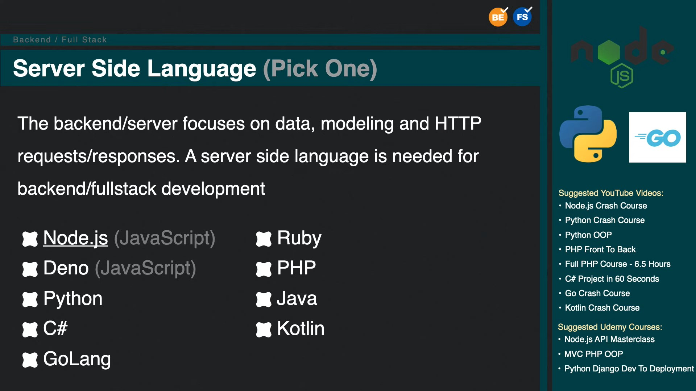
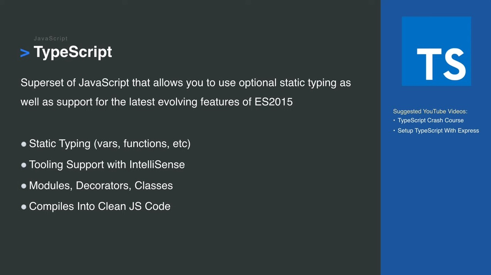
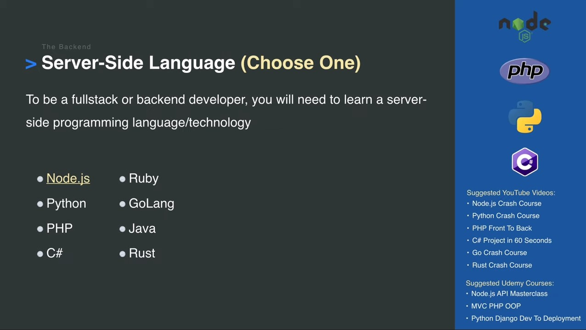
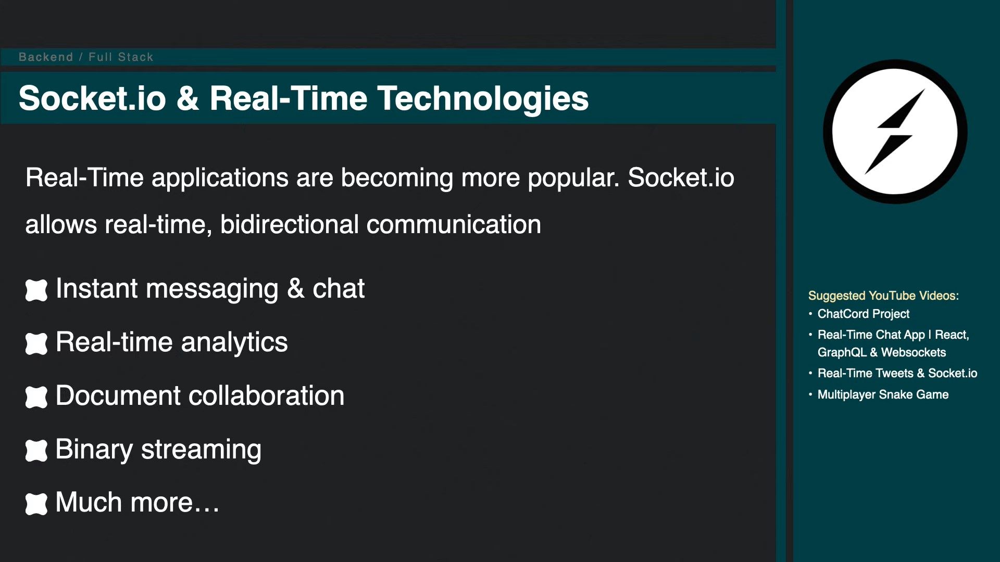
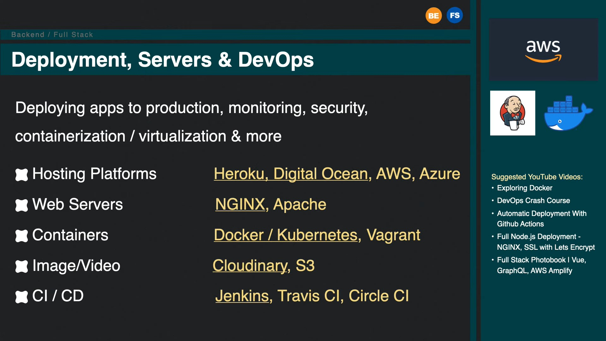
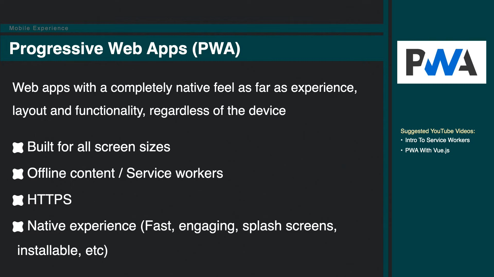
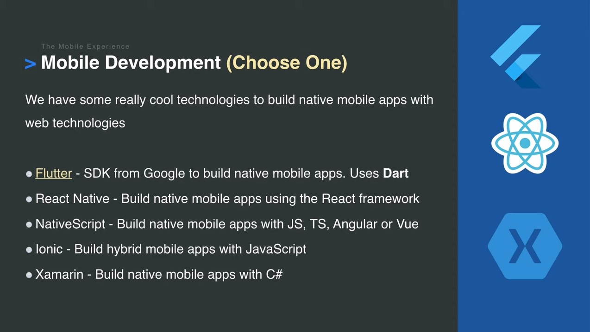
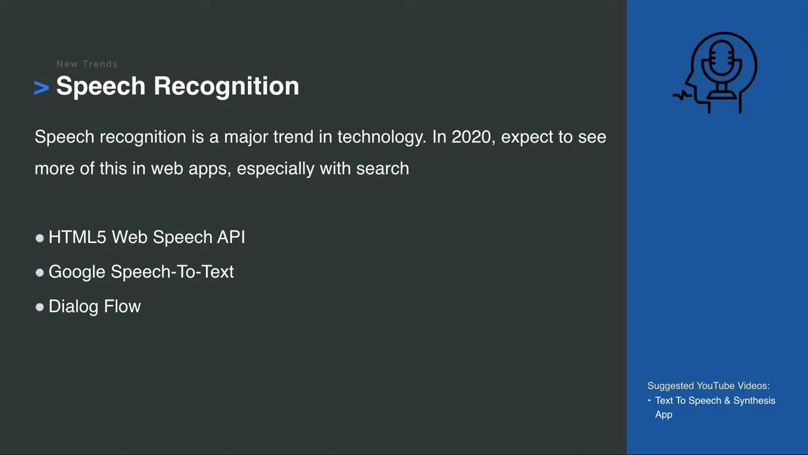

# Web Development In 2020 - A Practical Guide Course List

It's that time of year again, and Brad Traversy has released his Web Development roadmap for the upcoming year. It is a fantastic resource that I know we are all thankful for. And being a web developer has never been better, and as shown in the video there are a **TON** of technologies at our disposal! But, that can also be rather intimidating for newcomers. So I have comprised a list below of the top Udemy courses for each slide as well for other resources, as much as possible, hopefully easing your decision making. Each block of courses are listed in alphabetical order for simplicity's sake.

As Brad mentions in the video, you certainly **DO NOT** need to learn everything here. He is just providing you with the options of what you _CAN_ learn (and somethings you _SHOULD_ learn - such as HTML, CSS, and JavaScript), and he explains what these technologies are. So, it really is up to you what you want to learn.

**[Watch the video here](https://www.youtube.com/watch?v=0pThnRneDjw)**

And of course there are many other interesting and very good learning platforms besides Udemy, but it's the platform I am personally most familiar with and I think (??) is one of the most popular, so that's what I am going with. So without further ado, let's get learning!

But first, if Udemy's not your jam, no worries! There are plenty of other sites to learn from, some of which I've listed below:

## Udemy Alternatives

- [AcademicEarth](https://academicearth.org/)
- [Codecademy](https://www.codecademy.com/)
- [Coursera](https://www.coursera.org/)
- [Eduonix](https://www.eduonix.com/)
- [edX](https://www.edx.org/)
- [freeCodeCamp](https://www.freecodecamp.org/)
- [Frontend Masters](https://frontendmasters.com/)
- [Hacker.io](https://hackr.io/)
- [Khan Academy](https://www.khanacademy.org/)
- [Laracasts](https://laracasts.com/)
- [Learn X in Y Minutes](https://learnxinyminutes.com/)
- [Level Up Tutorials](https://www.leveluptutorials.com/)
- [Lynda](https://www.lynda.com/)
- [MDN Web Docs](https://developer.mozilla.org)
- [Packt](https://www.packtpub.com/)
- [Pluralsight](https://www.pluralsight.com/)
- [Scrimba](https://scrimba.com/)
- [Skillshare](https://www.skillshare.com/)
- [Teach Yourself Computer Science](https://teachyourselfcs.com/)
- [The Odin Project](https://www.theodinproject.com/)
- [Treehouse](https://teamtreehouse.com/)
- [Udacity](https://www.udacity.com/)
- [W3Schools](https://www.w3schools.com/)
- [Wes Bos](https://wesbos.com/)
- [YouTube](https://www.youtube.com/)

## Tools 1 - The Necessities

### Computer & OS

- Linux
- MacOS
- Windows

### Text Editors

- [Atom](https://atom.io/)
- [Brackets](http://brackets.io/)
- [Komodo Edit](https://www.activestate.com/products/komodo-edit/)
- [Sublime Text](https://www.sublimetext.com/)
- [Visual Studio Code](https://code.visualstudio.com/)

### IDEs

- [JetBrains](https://www.jetbrains.com/) _JetBrains has multiple IDEs for multiple languages_
- [Komodo IDE](https://www.activestate.com/products/komodo-ide/)
- [Visual Studio](https://visualstudio.microsoft.com/)

### Browser

- [Chrome](https://www.google.com/chrome/)
- [Firefox](https://www.mozilla.org/en-CA/firefox/)
- [Opera](https://www.opera.com/)

### Design

- [Adobe Illustrator](https://www.adobe.com/ca/products/illustrator.html)
- [Adobe Photoshop](https://www.photoshop.com/)
- [Adobe XD](https://www.adobe.com/ca/products/xd.html)
- [Affinity](https://affinity.serif.com)
- [Figma](https://www.figma.com/)
- [InVision](https://www.invisionapp.com/)
- [Sketch](https://www.sketch.com/)

## UI/UX

- [User Experience Design Essentials - Adobe XD UI UX Design](https://www.udemy.com/course/ui-ux-web-design-using-adobe-xd/) by Daniel Walter Scott _(93 lectures / 11.5hrs)_

Now while it is true that once you work on a team/for a company, there is very likely going to be a UI/UX Designer, and you will focus on the development aspect of that project. But having even a bit of experience under your belt and a keen eye for design can be greatly beneficial, especially if you want to work as a Front-End Developer. The course above by Daniel Walter Scott is perfect for just that. He walks you through the entire processing of being a UI/UX Designer, and you get to use Adobe XD, which is a completely free and fantastic wireframing/design tool.

## The Building Blocks & Responsive Design

### HTML & CSS

- [Build Responsive Real World Websites with HTML5 and CSS3](https://www.udemy.com/course/design-and-develop-a-killer-website-with-html5-and-css3/) by Jonas Schmedtmann _(77 lectures / 12hrs)_
- [Modern HTML & CSS From The Beginning (Including Sass)](https://www.udemy.com/course/modern-html-css-from-the-beginning/) by Brad Traversy _(128 lectures / 21hrs)_
- [Web Design for Beginners: Real World Coding in HTML & CSS](https://www.udemy.com/course/web-design-for-beginners-real-world-coding-in-html-css/) by Brad Schiff _(59 lectures / 9hrs)_

### CSS

- [Advanced CSS and Sass: Flexbox, Grid, Animations and More!](https://www.udemy.com/course/advanced-css-and-sass/) by Jonas Schmedtmann _(125 lectures / 28hrs)_
- [CSS - The Complete Guide 2020 (incl. Flexbox, Grid & Sass)](https://www.udemy.com/course/css-the-complete-guide-incl-flexbox-grid-sass/) by Maximilian Schwarzmüller _(296 lectures / 22.5hrs)_
- [CSS Bootcamp - Master CSS (Including CSS Grid / Flexbox)](https://www.udemy.com/course/css-bootcamp-master-in-css-including-css-grid-flexbox/) by Code And Create _(89 lectures / 11.5hrs)_

## Custom Reusable CSS Components

### Sass

- [Advanced CSS and Sass: Flexbox, Grid, Animations and More!](https://www.udemy.com/course/advanced-css-and-sass/) by Jonas Schmedtmann _(125 lectures / 28hrs)_
- [CSS - The Complete Guide 2020 (incl. Flexbox, Grid & Sass)](https://www.udemy.com/course/css-the-complete-guide-incl-flexbox-grid-sass/) by Maximilian Schwarzmüller _(296 lectures / 22.5hrs)_
- [SASS - The Complete SASS Course (CSS Preprocessor)](https://www.udemy.com/course/sass-the-complete-sass-course-css-preprocessor/) by Code And Create _(51 lectures / 6hrs)_
- [The Complete Sass & SCSS Course: From Beginner to Advanced](https://www.udemy.com/course/sasscourse/) by Joe Parys _(41 lectures / 4hrs)_
- [The Sass Course! Learn Sass for Real-World Websites](https://www.udemy.com/course/learn-sass/) by Brad Hussey _(18 lectures / 3.5hrs)_

## CSS Frameworks (Choose One)

### Bootstrap

- [Bootstrap 4 - Create 4 Real World Projects](https://www.udemy.com/course/bootstrap-4-create-4-real-world-projects-latest-411/) by Code And Create _(64 lectures / 10hrs)_
- [Bootstrap 4 From Scratch With 5 Projects](https://www.udemy.com/course/bootstrap-4-from-scratch-with-5-projects/) by Brad Traversy _(74 lectures / 11.5hrs)_
- [Bootstrap 4 Tutorial and 10 Projects Course](https://www.udemy.com/course/bootstrap-4-beta-ultimate-projects-course/) by John Smilga _(250 lectures / 44hrs)_
- [The Bootstrap 4 Bootcamp](https://www.udemy.com/course/bootstrap-4-bootcamp/) by Colt Steele _(87 lectures / 11.5hrs)_
- [The Complete Bootstrap Masterclass Course - Build 4 Projects](https://www.udemy.com/course/bootstrapcourse/) by Joe Parys _(67 lectures / 7hrs)_

### Materialize

- [Materialize CSS From Scratch With 5 Projects](https://www.udemy.com/course/materialize-css-from-scratch-with-5-projects/) by Brad Traversy _(63 lectures / 10.5hrs)_

## Vanilla JavaScript

### For Beginners

- [JavaScript - The Complete Guide 2020 (Beginner + Advanced)](https://www.udemy.com/course/javascript-the-complete-guide-2020-beginner-advanced/) by Maximilian Schwarzmüller _(614 lectures / 52.5hrs)_
- [JavaScript: Understanding the Weird Parts](https://www.udemy.com/course/understand-javascript/) by Anthony Alicea _(85 lectures / 11.5hrs)_
- [Learn JavaScript: Full-Stack from Scratch](https://www.udemy.com/course/learn-javascript-full-stack-from-scratch/) by Brad Schiff _(119 lectures / 27hrs)_
- [Modern JavaScript (from Novice to Ninja)](https://www.udemy.com/course/modern-javascript-from-novice-to-ninja/) by Shaun Pelling _(173 lectures / 19hrs)_
- [Modern JavaScript From The Beginning](https://www.udemy.com/course/modern-javascript-from-the-beginning/) by Brad Traversy _(122 lectures / 21.5hrs)_
- [The Complete JavaScript Course 2020: Build Real Projects!](https://www.udemy.com/course/the-complete-javascript-course/) by Jonas Schmedtmann _(166 lectures / 28hrs)_
- [The Modern JavaScript Bootcamp](https://www.udemy.com/course/modern-javascript/) by Andrew Mead _(155 lectures / 29.5hrs)_
- [The Modern Javascript Bootcamp Course (2020)](https://www.udemy.com/course/javascript-beginners-complete-tutorial/) by Colt Steele & Stephen Grider _(483 lectures / 52hrs)_

### ES6 Focused

- [Accelerated ES6 JavaScript Training](https://www.udemy.com/course/es6-bootcamp-next-generation-javascript/) by Maximilian Schwarzmüller _(115 lectures / 6hrs)_
- [ES6 Javascript: The Complete Developer's Guide](https://www.udemy.com/course/javascript-es6-tutorial/) by Stephen Grider _(68 lectures / 6hrs)_

### Project Focused

- [20 Web Projects With Vanilla JavaScript](https://www.udemy.com/course/web-projects-with-vanilla-javascript/) by Brad Traversy _(121 lectures / 16hrs)_
- [JavaScript 2020 Build 55+ Real Projects Games Pure JS code](https://www.udemy.com/course/javascript-course-projects/) by Laurence Svekis _(687 lectures / 50hrs)_
- [Javascript Tutorial and Projects Course](https://www.udemy.com/course/javascript-tutorial-for-beginners-w/) by John Smilga _(329 lectures / 47hrs)_

### Advanced JavaScript

- [Advanced JavaScript](https://www.udemy.com/course/javascript-advanced/) by Asim Hussain _(47 lectures / 6.5hrs)_
- [Advanced JavaScript Topics](https://www.udemy.com/course/learn-modern-javascript-advanced-topics/) by Steven Hancock _(93 lectures / 16hrs)_
- [JavaScript: The Advanced Concepts](https://www.udemy.com/course/advanced-javascript-concepts/) by Andrei Neagoie _(218 lectures / 24.5hrs)_

## Tools 2 - Essential Dev Tools

### Git/GitHub

- [Complete Git Guide: Understand and master Git and GitHub](https://www.udemy.com/course/git-and-github-complete-guide/) by Bogdan Stashchuk _(215 lectures / 18hrs)_
- [Git & GitHub Masterclass](https://www.udemy.com/course/git-and-github-masterclass/) by Tim Buchalka & Eduardo Rosas _(73 lectures / 11.5hrs)_
- [Git a Web Developer Job: Mastering the Modern Workflow](https://www.udemy.com/course/git-a-web-developer-job-mastering-the-modern-workflow/) by Brad Schiff _(68 lectures / 15hrs)_
- [Git Complete: The definitive, step-by-step guide to Git](https://www.udemy.com/course/git-complete/) by Jason Taylor _(84 lectures / 6hrs)_
- [Git Essentials: Learn Git with Bitbucket and Sourcetree](https://www.udemy.com/course/git-with-bitbucket-and-sourcetree/) by Justin Rose _(58 lectures / 2.5hrs)_
- [Git Github Gitkraken: Version Control without Command Line](https://www.udemy.com/course/git-github-gitkraken-version-control-without-command-line/) by Peter Gunardi _(35 lectures / 2.5hrs)_
- [GIT: Advanced commands](https://www.udemy.com/course/git-advanced-commands/) by Brian Gorman _(40 lectures / 4hrs)_
- [GitHub Ultimate: Master Git and GitHub - Beginner to Expert](https://www.udemy.com/course/github-ultimate/) by Jason Taylor _(151 lectures / 6.5hrs)_

### NPM

- [Understanding NPM - Node.js Package Manager](https://www.udemy.com/course/understanding-npm/) by Bogdan Stashchuk _(40 lectures / 2.5hrs)_

### Yarn

- [Yarn Dependency Management - The Complete Guide](https://www.udemy.com/course/yarn-dependency-management/) by Ray Viljoen _(22 lectures / 1.5hrs)_

### Webpack

- [Webpack 4 in 2020: The Complete Tutorial For Beginners](https://www.udemy.com/course/webpack-from-beginner-to-advanced/) by Viktor Pyskunov _(52 lectures / 3.5hrs)_

### A Bit of Everything

- [Git a Web Developer Job: Mastering the Modern Workflow](https://www.udemy.com/course/git-a-web-developer-job-mastering-the-modern-workflow/) by Brad Schiff _(68 lectures / 15hrs)_
- [JavaScript Infrastructure: CLI, NPM, Babel 7 and Webpack 4](https://www.udemy.com/course/2019-js-infrastructure-course-npm-babel-7-webpack-4/) by OnlyKiosk Tech _(68 lectures / 3.5hrs)_

## Front-End Framework & State Management (Choose One)

### React

- [Advanced React and Redux: 2020 Edition](https://www.udemy.com/course/react-redux-tutorial/) by Stephen Grider _(239 lectures / 21hrs)_
- [Complete React Developer in 2020 (w/ Redux, Hooks, GraphQL)](https://www.udemy.com/course/complete-react-developer-zero-to-mastery/) by Andrei Neagoie & Yihua Zhang _(336 lectures / 40hrs)_
- [GraphQL with React: The Complete Developers Guide](https://www.udemy.com/course/graphql-with-react-course/) by Stephen Grider _(115 lectures / 13hrs)_
- [Modern React with Redux [2020 Update]](https://www.udemy.com/course/react-redux/) by Stephen Grider _(487 lectures / 47.5hrs)_
- [React - The Complete Guide (incl Hooks, React Router, Redux)](https://www.udemy.com/course/react-the-complete-guide-incl-redux/) by Maximilian Schwarzmüller _(543 lectures / 45hrs)_
- [React Front To Back](https://www.udemy.com/course/modern-react-front-to-back/) by Brad Traversy _(91 lectures / 14hrs)_
- [React Tutorial and Projects Course](https://www.udemy.com/course/react-tutorial-and-projects-course/) by John Smilga _(361 lectures / 45.5hrs)_
- [The Complete React Developer Course (w/ Hooks and Redux)](https://www.udemy.com/course/react-2nd-edition/) by Andrew Mead _(200 lectures / 39hrs)_
- [The Complete React Js & Redux Course - Build Modern Web Apps](https://www.udemy.com/course/the-complete-react-js-redux-course-build-modern-web-apps/) by Rob Percival & Rayan Slim _(71 lectures / 8.5hrs)_
- [The Modern React Bootcamp (Hooks, Context, NextJS, Router)](https://www.udemy.com/course/modern-react-bootcamp/) by Colt Steele _(312 lectures / 39hrs)_
- [The React practice course, learn by building projects.](https://www.udemy.com/course/the-react-practice-course-learn-by-building-projects/) by Coding Revolution _(218 lectures / 43.5hrs)_

### Vue

- [Build Web Apps with Vue JS 2 & Firebase](https://www.udemy.com/course/build-web-apps-with-vuejs-firebase/) by Shaun Pelling _(118 lectures / 11.5hrs)_
- [The complete Vue JS course](https://www.udemy.com/course/the-complete-vue-js-course/) by Coding Revolution _(204 lectures / 25.5hrs)_
- [The Complete Vue JS Developer Course – inc. Vue JS 2!](https://www.udemy.com/course/vue-js-2-the-full-guide-by-real-apps-vuex-router-node/) by Filip Jerga & Rob Percival _(279 lectures / 44hrs)_
- [Vue JS 2 - The Complete Guide (incl. Vue Router & Vuex)](https://www.udemy.com/course/vuejs-2-the-complete-guide/) by Maximilian Schwarzmüller _(400 lectures / 22hrs)_
- [Vue JS 2: From Beginner to Professional (includes Vuex)](https://www.udemy.com/course/vuejs-from-beginner-to-professional/) by Bo Andersen _(221 lectures / 15.5hrs)_
- [Vue JS Essentials with Vuex and Vue Router](https://www.udemy.com/course/vue-js-course/) by Stephen Grider _(139 lectures / 10.5hrs)_

### Angular

- [Angular (Full App) with Angular Material, Angularfire & NgRx](https://www.udemy.com/course/angular-full-app-with-angular-material-angularfire-ngrx/) by Maximilian Schwarzmüller _(140 lectures / 11hrs)_
- [Angular - The Complete Guide (2020 Edition)](https://www.udemy.com/course/the-complete-guide-to-angular-2/) by Maximilian Schwarzmüller _(503 lectures / 37hrs)_
- [Angular Crash Course for Busy Developers](https://www.udemy.com/course/angular-crash-course/) by Mosh Hamedani _(137 lectures / 10.5hrs)_
- [Angular Essentials (Angular 2+ with TypeScript)](https://www.udemy.com/course/angular-essentials-angular-2-angular-4-with-typescript/) by Maximilian Schwarzmüller _(119 lectures / 6.5hrs)_
- [Angular Front To Back](https://www.udemy.com/course/angular-4-front-to-back/) by Brad Traversy _(73 lectures / 11.5hrs)_
- [Learn and Understand AngularJS](https://www.udemy.com/course/learn-angularjs/) by Anthony Alicea _(55 lectures / 7hrs)_
- [NgRx (with NgRx Data) - The Complete Guide (FREE E-Book)](https://www.udemy.com/course/ngrx-course/) by Angular University _(52 lectures / 6hrs)_
- [The Complete Angular Course: Beginner to Advanced](https://www.udemy.com/course/the-complete-angular-master-class/) by Mosh Hamedani _(376 lectures / 29.5hrs)_

## Svelte

### Svelte

- [Svelte Tutorial and Projects Course](https://www.udemy.com/course/svelte-tutorial-and-projects-course/) by John Smilga _(150 lectures / 15.5hrs)_
- [Svelte.js - The Complete Guide (incl. Sapper.js)](https://www.udemy.com/course/sveltejs-the-complete-guide/) by Maximilian Schwarzmüller _(196 lectures / 12.5hrs)_

## Server-Side Rendering

### Next (React)

- [Complete Next.js with React & Node - Beautiful Portfolio App](https://www.udemy.com/course/awesome-nextjs-with-react-and-node-amazing-portfolio-app/) by Filip Jerga _(241 lectures / 38.5hrs)_
- [Server side rendering with Next + React](https://www.udemy.com/course/server-side-rendering-with-next-react/) by Coding Revolution _(170 lectures / 29.5hrs)_
- [Universal React with Next.js - The Ultimate Guide](https://www.udemy.com/course/universal-react-with-nextjs-the-ultimate-guide/) by Reed Barger _(90 lectures / 9.5hrs)_

### Nuxt (Vue)

- [Nuxt.js - Vue.js on Steroids](https://www.udemy.com/course/nuxtjs-vuejs-on-steroids/) by Maximilian Schwarzmüller _(106 lectures / 6.5hrs)_

## Static Site Generators

### Gatsby (React)

- [Gatsby JS & Firebase: Build HYBRID realtime + static sites](https://www.udemy.com/course/gatsby-js-firebase-hybrid-realtime-static-sites/) by Tom Phillips _(65 lectures / 5hrs)_
- [Gatsby JS: Build PWA Blog With GraphQL And React + WordPress](https://www.udemy.com/course/gatsby-js-build-pwa-blog-with-graphql-and-react-wordpress/) by Rangel Stoilov _(42 lectures / 4hrs)_
- [Gatsby JS: Build static sites with React Wordpress & GraphQL](https://www.udemy.com/course/gatsby-js-react-wordpress-graphql/) by Tom Phillips _(42 lectures / 4hrs)_
- [Gatsby Tutorial and Projects Course](https://www.udemy.com/course/gatsby-tutorial-and-projects-course/) by John Smilga _(323 lectures / 38.5hrs)_
- [Gatsby JS | Gatsby with Wordpress as a headless CMS [2020]](https://www.udemy.com/course/gatsby-with-wordpress/) by Thomas Weibenfalk _(31 lectures / 6hrs)_
- [The Gatsby Masterclass](https://www.udemy.com/course/the-gatsby-masterclass/) by Reed Barger _(43 lectures / 4hrs)_

### Gridsome (Vue)

- [Blazing-Fast Vue and GraphQL with Gridsome](https://www.udemy.com/course/blazing-fast-vue-and-graphql-with-gridsome/) by Reed Barger _(28 lectures / 3hrs)_

## TypeScript

### TypeScript

- [Typescript: The Complete Developer's Guide [2020]](https://www.udemy.com/course/typescript-the-complete-developers-guide/) by Stephen Grider _(278 lectures / 24.5hrs)_
- [Understanding TypeScript - 2020 Edition](https://www.udemy.com/course/understanding-typescript/) by Maximilian Schwarzmüller _(352 lectures / 22hrs)_

## Server-Side Language (Choose One)

### Node

- [Learn and Understand NodeJS](https://www.udemy.com/course/understand-nodejs/) by Anthony Alicea _(97 lectures / 13hrs)_
- [Node JS: Advanced Concepts](https://www.udemy.com/course/advanced-node-for-developers/) by Stephen Grider _(166 lectures / 16hrs)_
- [Node.js API Masterclass With Express & MongoDB](https://www.udemy.com/course/nodejs-api-masterclass/) by Brad Traversy _(76 lectures / 12hrs)_
- [Node.js, Express, MongoDB & More: The Complete Bootcamp 2020](https://www.udemy.com/course/nodejs-express-mongodb-bootcamp/) by Jonas Schmedtmann _(166 lectures / 16hrs)_
- [Node.js: The Complete Guide to Build RESTful APIs (2018)](https://www.udemy.com/course/nodejs-master-class/) by Mosh Hamedani _(224 lectures / 15hrs)_
- [NodeJS - The Complete Guide (incl. MVC, REST APIs, GraphQL)](https://www.udemy.com/course/nodejs-the-complete-guide/) by Maximilian Schwarzmüller _(487 lectures / 36hrs)_
- [The Complete Node.js Developer Course (3rd Edition)](https://www.udemy.com/course/the-complete-nodejs-developer-course-2/) by Andrew Mead & Rob Percival _(177 lectures / 34.5hrs)_
- [The Definitive Node.Js Developer Course](https://www.udemy.com/course/the-definitive-nodejs-developer-course/) by Coding Revolution _(239 lectures / 23.5hrs)_

### Python

- [Complete Python Bootcamp: Go from zero to hero in Python 3](https://www.udemy.com/course/complete-python-bootcamp/) by Jose Portilla _(185 lectures / 24hrs)_
- [Complete Python Developer in 2020: Zero to Mastery](https://www.udemy.com/course/complete-python-developer-zero-to-mastery/) by Andrei Neagoie _(320 lectures / 30.5hrs)_
- [Learn Python Programming Masterclass](https://www.udemy.com/course/python-the-complete-python-developer-course/) by Tim Buchalka & Jean-Paul Roberts _(276 lectures / 46hrs)_
- [Python for Absolute Beginners](https://www.udemy.com/course/python-for-absolute-beginners-u/) by Green Chameleon Learning _(67 lectures / 3hrs)_
- [The Complete Python Course | Learn Python by Doing](https://www.udemy.com/course/the-complete-python-course/) by Jose Salvatierra & Rob Percival _(343 lectures / 35hrs)_
- [The Modern Python 3 Bootcamp](https://www.udemy.com/course/the-modern-python3-bootcamp/) by Colt Steele _(374 lectures / 29.5hrs)_
- [The Python Bible™ | Everything You Need to Program in Python](https://www.udemy.com/course/the-python-bible/) by Ziyad Yehia _(73 lectures / 9hrs)_
- [The Python Mega Course: Build 10 Real World Applications](https://www.udemy.com/course/the-python-mega-course/) by Ardit Sulce _(264 lectures / 23.5hrs)_

### PHP

- [Object Oriented PHP & MVC](https://www.udemy.com/course/object-oriented-php-mvc/) by Brad Traversy _(44 lectures / 6.5hrs)_
- [PHP for Beginners - Become a PHP Master - CMS Project](https://www.udemy.com/course/php-for-complete-beginners-includes-msql-object-oriented/) by Edwin Diaz _(344 lectures / 38hrs)_
- [PHP OOP: Object Oriented Programming for beginners + Project](https://www.udemy.com/course/oop-php-object-oriented-programing-with-project-1-course/) by Edwin Diaz _(224 lectures / 18.5hrs)_

### C Sharp (C#)

- [C# Advanced Topics: Prepare for Technical Interviews](https://www.udemy.com/course/csharp-advanced/) by Mosh Hamedani _(21 lectures / 3hrs)_
- [C# Basics for Beginners: Learn C# Fundamentals by Coding](https://www.udemy.com/course/csharp-tutorial-for-beginners/) by Mosh Hamedani _(87 lectures / 5hrs)_
- [C# Intermediate: Classes, Interfaces and OOP](https://www.udemy.com/course/csharp-intermediate-classes-interfaces-and-oop/) by Mosh Hamedani _(45 lectures / 5.5hrs)_
- [Complete C# Masterclass](https://www.udemy.com/course/complete-csharp-masterclass/) by Denis Panjuta _(222 lectures / 31.5hrs)_
- [Design Patterns in C# and .NET](https://www.udemy.com/course/design-patterns-csharp-dotnet/) by Dmitri Nesteruk _(145 lectures / 15.5hrs)_
- [Learn C# By Building Applications](https://www.udemy.com/course/learn-csharp-by-building-applications/) by Avetis Ghukasyan _(100 lectures / 13.5hrs)_
- [The Complete C# and Object-Oriented Programming Course](https://www.udemy.com/course/the-complete-c-sharp-developer-course/) by Ahmad Mohey _(21 lectures / 21hrs)_

### Ruby

- [Learn to Code with Ruby](https://www.udemy.com/course/learn-to-code-with-ruby-lang/) by Boris Paskhaver _(257 lectures / 31.5hrs)_

### GoLang

- [Go (Golang): The Complete Bootcamp](https://www.udemy.com/course/learn-go-the-complete-bootcamp-course-golang/) by Jose Portilla & Inanc Gumus _(297 lectures / 22hrs)_
- [Go: The Complete Developer's Guide (Golang)](https://www.udemy.com/course/go-the-complete-developers-guide/) by Stephen Grider _(82 lectures / 9hrs)_
- [Learn How To Code: Google's Go (golang) Programming Language](https://www.udemy.com/course/learn-how-to-code/) by Todd McLeod _(373 lectures / 46.5hrs)_
- [Web Development w/ Google’s Go (golang) Programming Language](https://www.udemy.com/course/go-programming-language/) by Todd McLeod _(171 lectures / 19hrs)_

### Java

- [Java In-Depth: Become a Complete Java Engineer!](https://www.udemy.com/course/java-in-depth-become-a-complete-java-engineer/) by Dheeru Mundluru _(349 lectures / 62.5hrs)_
- [Java Programming Masterclass for Software Developers](https://www.udemy.com/course/java-the-complete-java-developer-course/) by Tim Buchalka & Kevin McClung _(396 lectures / 79.5hrs)_

### Rust

- [The Rust Programming Language](https://www.udemy.com/course/rust-lang/) by Dmitri Nesteruk _(51 lectures / 7hrs)_

## Server-Side Framework (Choose One)

### Express (Node)

- [Just Express (with a bunch of node and http). In detail.](https://www.udemy.com/course/just-express-with-a-bunch-of-node-and-http-in-detail/) by Robert Bunch _(57 lectures / 12.5hrs)_
- **_See Node section above - Express is covered in those courses as well_**

### Koa (Node)

- [Node.Js: Learning Koa.Js By Building REST APIs](https://www.udemy.com/course/learning-koajs-by-building-rest-apis/) by Haider Malik _(57 lectures / 12.5hrs)_

### Nest (Node)

- [NestJs in Practice (with MongoDB)](https://www.udemy.com/course/nestjs-course/) by Angular University _(45 lectures / 4.5hrs)_
- [NestJS Zero to Hero - Modern TypeScript Back-end Development](https://www.udemy.com/course/nestjs-zero-to-hero/) by Ariel Weinberger _(102 lectures / 6.5hrs)_

### Laravel (PHP)

- [Laravel 2019, the complete guide with real world projects](https://www.udemy.com/course/best-laravel/) by Kati Frantz _(196 lectures / 24hrs)_
- [Master Laravel PHP for Beginners and Intermediate](https://www.udemy.com/course/laravel-beginner-fundamentals/) by Piotr Jura _(216 lectures / 30hrs)_
- [PHP with Laravel for beginners - Become a Master in Laravel](https://www.udemy.com/course/php-with-laravel-for-beginners-become-a-master-in-laravel/) by Edwin Diaz _(336 lectures / 32hrs)_
- [RESTful API with Laravel: Build a real API with Laravel](https://www.udemy.com/course/restful-api-with-laravel-php-homestead-passport-hateoas/) by JuanDMeGon _(225 lectures / 14.5hrs)_

### Symfony (PHP)

- [Learn PHP Symfony 4 Hands-On Creating Real World Application](https://www.udemy.com/course/learn-symfony-4-hands-on-creating-a-real-world-application/) by Piotr Jura _(114 lectures / 13.5hrs)_
- [Learn Symfony 3 framework by practical examples](https://www.udemy.com/course/learn-symfony-3-framework-by-practical-examples/) by Wojciech Ciolko _(48 lectures / 4hrs)_
- [Symfony 4 & 5 Web Development Guide: Beginner To Advanced](https://www.udemy.com/course/symfony-4-web-development-from-beginner-to-advanced/) by Symfony & Laravel Stuff _(267 lectures / 20hrs)_

### Django (Python)

- [Coding for Entrepreneurs: Learn Python, Django, and More](https://www.udemy.com/course/coding-for-entrepreneurs/) by Justin Mitchel _(251 lectures / 45hrs)_
- [Django & Python: complete BUNDLE + Django real world project](https://www.udemy.com/course/python-django-tkinter-complete-bundle-advance/) by Arash Shahvar _(287 lectures / 47hrs)_
- [Django 2.2 & Python | The Ultimate Web Development Bootcamp](https://www.udemy.com/course/the-ultimate-beginners-guide-to-django-django-2-python-web-dev-website/) by Nick Walter _(78 lectures / 10hrs)_
- [Django Core | A Reference Guide to Core Django Concepts](https://www.udemy.com/course/django-core/) by Justin Mitchel _(159 lectures / 18.5hrs)_
- [Python and Django Full Stack Web Developer Bootcamp](https://www.udemy.com/course/python-and-django-full-stack-web-developer-bootcamp/) by Jose Portilla _(198 lectures / 32hrs)_
- [Python Django Dev To Deployment](https://www.udemy.com/course/python-django-dev-to-deployment/) by Brad Traversy _(70 lectures / 11hrs)_

### Flask (Python)

- [Advanced REST APIs with Flask and Python](https://www.udemy.com/course/advanced-rest-apis-flask-python/) by Jose Salvatierra _(130 lectures / 12.5hrs)_
- [Complete Python Web Course: Build 8 Python Web Apps](https://www.udemy.com/course/the-complete-python-web-course-learn-by-building-8-apps/) by Jose Salvatierra _(161 lectures / 15.5hrs)_
- [Python and Flask Bootcamp: Create Websites using Flask!](https://www.udemy.com/course/python-and-flask-bootcamp-create-websites-using-flask/) by Jose Portilla _(126 lectures / 20hrs)_
- [Python Flask for Beginners: Build a CRUD web app using Flask](https://www.udemy.com/course/python-flask-beginners/) by Febin George _(28 lectures / 3hrs)_
- [REST APIs with Flask and Python](https://www.udemy.com/course/rest-api-flask-and-python/) by Jose Salvatierra _(170 lectures / 17hrs)_
- [The Flask Mega-Tutorial (Python Web Development)](https://www.udemy.com/course/flask-mega-tutorial/) by Miguel Grinberg _(192 lectures / 11.5hrs)_
- [The Ultimate Flask Course](https://www.udemy.com/course/the-ultimate-flask-course/) by Anthony Herbert _(340 lectures / 27hrs)_

### ASP.NET MVC (C#)

- [The Complete ASP.NET MVC 5 Course](https://www.udemy.com/course/the-complete-aspnet-mvc-5-course/) by Mosh Hamedani _(139 lectures / 7.5hrs)_

### Spring MVC (Java)

- [Java Spring Tutorial Masterclass - Learn Spring Framework 5](https://www.udemy.com/course/java-spring-framework-masterclass/) by Tim Buchalka & Goran Lochert _(273 lectures / 45hrs)_
- [RESTful Web Services, Java, Spring Boot, Spring MVC and JPA](https://www.udemy.com/course/restful-web-service-with-spring-boot-jpa-and-mysql/) by Sergey Kargopolov _(233 lectures / 20hrs)_
- [Spring Framework 5: Beginner to Guru](https://www.udemy.com/course/spring-framework-5-beginner-to-guru/) by John Thompson _(498 lectures / 52.5hrs)_
- [Spring & Hibernate for Beginners (includes Spring Boot)](https://www.udemy.com/course/spring-hibernate-tutorial/) by Chad Darby _(561 lectures / 41hrs)_

### Grails (Java)

- [Mastering Grails. A Comprehensive Grails Course.](https://www.udemy.com/course/mastering-grails/) by Infinite Skills _(71 lectures / 5.5hrs)_

### Ruby on Rails (Ruby)

- [Dissecting Ruby on Rails 5 - Become a Professional Developer](https://www.udemy.com/course/professional-rails-5-development-course/) by Jordan Hudgens _(226 lectures / 40hrs)_
- [The Complete Ruby on Rails Developer Course](https://www.udemy.com/course/the-complete-ruby-on-rails-developer-course/) by Rob Percival & Mashrur Hossain _(376 lectures / 40hrs)_

## Database (Choose One)

### PostgreSQL

- [Intro To PostgreSQL Databases With PgAdmin For Beginners](https://www.udemy.com/course/intro-to-postgresql-databases-with-pgadmin/) by John Elder _(24 lectures / 2hrs)_
- [SQL & Database Design A-Z™: Learn MS SQL Server + PostgreSQL](https://www.udemy.com/course/sqldatabases/) by Kirill Eremenko & Ilya Eremenko _(103 lectures / 12.5hrs)_
- [SQL & PostgreSQL for Beginners](https://www.udemy.com/course/sql-and-postgresql-for-beginners/) by Jon Avis _(109 lectures / 8hrs)_
- [Up and Running With PostgreSQL 11](https://www.udemy.com/course/postgres/) by Nelson Djalo _(103 lectures / 12.5hrs)_

### MySQL

- [MySQL, SQL and Stored Procedures from Beginner to Advanced](https://www.udemy.com/course/mysql-and-sql-from-beginner-to-advanced/) by John Purcell _(136 lectures / 18.5hrs)_
- [SQL - MySQL for Data Analytics and Business Intelligence](https://www.udemy.com/course/sql-mysql-for-data-analytics-and-business-intelligence/) by 365 Careers _(286 lectures / 9.5hrs)_
- [SQL Beginner to Guru: MySQL Edition - Master SQL with MySQL](https://www.udemy.com/course/sql-beginner-to-guru-mysql-edition/) by John Thompson _(166 lectures / 11hrs)_
- [SQL for Beginners: Learn SQL using MySQL and Database Design](https://www.udemy.com/course/sql-for-beginners-course/) by Tim Buchalka & Jon Avis _(122 lectures / 8hrs)_
- [The Ultimate MySQL Bootcamp: Go from SQL Beginner to Expert](https://www.udemy.com/course/the-ultimate-mysql-bootcamp-go-from-sql-beginner-to-expert/) by Colt Steele & Ian Schoonover _(319 lectures / 20hrs)_

### MS SQL

- [SQL & Database Design A-Z™: Learn MS SQL Server + PostgreSQL](https://www.udemy.com/course/sqldatabases/) by Kirill Eremenko & Ilya Eremenko _(103 lectures / 12.5hrs)_

### MongoDB

- [MongoDB - The Complete Developer's Guide](https://www.udemy.com/course/mongodb-the-complete-developers-guide/) by Maximilian Schwarzmüller _(263 lectures / 17hrs)_
- [MongoDB Essentials - Complete MongoDB Guide](https://www.udemy.com/course/mongodb-essentials-m/) by John Purcell _(223 lectures / 10.5hrs)_
- [The Complete Developers Guide to MongoDB](https://www.udemy.com/course/the-complete-developers-guide-to-mongodb/)by Stephen Grider _(129 lectures / 13.5hrs)_

### CouchDB

- [Understanding CouchDB : Learn Basic & Advanced NoSQL Skills](https://www.udemy.com/course/understanding-couchdb/) by Greg Miller (aka Mad Pink) _(51 lectures / 6.5hrs)_

### Firebase

- **NOTE** There aren't really any courses on JUST Firebase specifically, it is usually paired with something else. Popular choices include **Angular**, **Vue**, **iOS**, & **Android**.

### Azure & AWS

- There are _*WAY*_ too many course on these, and I am not familiar with them at all, so I am not sure what to place here. You will have to search/research them on your own.

### Redis

- [Learn Redis from Scratch](https://www.udemy.com/course/learn-redis-from-scratch/) by Eduonix _(32 lectures / 3hrs)_

## GraphQL

### GraphQL

- [The Modern GraphQL Bootcamp (with Node.js and Apollo)](https://www.udemy.com/course/graphql-bootcamp/) by Andrew Mead _(118 lectures / 23.5hrs)_
- **NOTE:** Similar to Firebase, GraphQL is also usually paired with something else. The most popular of which seem to be **React**, **Node**, & **Gatsby**.

## Content Management

### WordPress

- [Become a WordPress Developer: Unlocking Power With Code](https://www.udemy.com/course/wordpress-for-beginners-create-a-website-blog-step-by-step/) by Brad Schiff _(113 lectures / 27hrs)_
- [Complete WordPress Development Themes and Plugins Course](https://www.udemy.com/course/wordpress-theme-and-plugin-development-course/) by Zac Gordon _(175 lectures / 16hrs)_
- [The Complete WordPress Aliexpress Dropship course](https://www.udemy.com/course/the-complete-aliexpress-dropshipping-course/) by Tim Sharp _(65 lectures / 4.5hrs)_
- [The Complete WordPress Website Business Course](https://www.udemy.com/course/the-complete-wordpress-website-business-course/) by Rob Percival & Gregg Davis _(102 lectures / 21.5hrs)_
- [Wordpress for Beginners - Master Wordpress Quickly](https://www.udemy.com/course/wordpress-for-beginners-course/) by Andrew Williams _(92 lectures / 7.5hrs)_
- [WordPress for Beginners: Create a Website Step by Step](https://www.udemy.com/course/wordpress-for-beginners-create-a-website-blog-step-by-step/) by Brad Schiff _(23 lectures / 5hrs)_
- [WordPress Theme Development with Bootstrap](https://www.udemy.com/course/bootstrap-to-wordpress/) by Brad Hussey _(83 lectures / 12hrs)_

### Drupal

- [Drupal 8 for Beginners](https://www.udemy.com/course/drupal-8-for-beginners/) by Packt Publishing _(37 lectures / 4hrs)_
- [DRUPAL TUTORIAL: Drupal 8 Beginner to Advanced in 8 PROJECTS](https://www.udemy.com/course/drupal-tutorial/) by Srikanth Shirodkar _(79 lectures / 7.5hrs)_
- [Learning Drupal 8](https://www.udemy.com/course/learning-drupal-8/) by Infinite Skills _(101 lectures / 9.5hrs)_

## Deployment & DevOps

### SSH (Secure Shell)

- [Beginner SSH Secure Shell - Hands on!](https://www.udemy.com/course/sshcourse/) by Patrik Staš _(61 lectures / 4.5hrs)_
- [Secure Shell Fundamentals - Learn SSH By Configuring It](https://www.udemy.com/course/secure-shell-fundamentals-learn-ssh-by-configuring-it/) by Ted LeRoy _(33 lectures / 3.5hrs)_

### NGINX

- [Nginx Fundamentals: High Performance Servers from Scratch](https://www.udemy.com/course/nginx-fundamentals/) by Ray Viljoen _(39 lectures / 4hrs)_
- [The Perfect Nginx Server - Ubuntu Edition](https://www.udemy.com/course/the-perfect-nginx-server-ubuntu-edition/) by Andrew Eaton _(94 lectures / 9hrs)_

### Apache

- [Setup Your Own Web Hosting Environment](https://www.udemy.com/course/setup-your-own-web-hosting-environment/) by Gabriel Avramescu _(17 lectures / 2hrs)_
- _There a ton of variants when it comes to Apache. There's **Tomcat**, **Kafka**, **Spark**, **Cassandra**, and more. You'll have to do some research on your own which one suits your needs as I am not familiar with this topic myself._

### Linode

- [Setup a Virtual Web Server using Linode or Digital Ocean](https://www.udemy.com/course/setup-a-virtual-web-server-using-linode-or-digital-ocean/) by YouAccel Training _(37 lectures / 2.5hrs)_

### Heroku

- While there aren't really any courses on how to deploy a site to Heroku, there are plenty of tutorials over on [YouTube](https://www.youtube.com/results?search_query=deploy+to+heroku) you can use.

### Docker

- [Docker and Kubernetes: The Complete Guide](https://www.udemy.com/course/docker-and-kubernetes-the-complete-guide/) by Stephen Grider _(299 lectures / 21.5hrs)_
- [Docker Crash Course for busy DevOps and Developers](https://www.udemy.com/course/docker-tutorial-for-devops-run-docker-containers/) by Tao W. & James Lee _(49 lectures / 3hrs)_
- [Docker for the Absolute Beginner - Hands On - DevOps](https://www.udemy.com/course/learn-docker/) by Mumshad Mannambeth _(48 lectures / 4hrs)_
- [Docker Mastery: with Kubernetes +Swarm from a Docker Captain](https://www.udemy.com/course/docker-mastery/) by Bret Fisher _(172 lectures / 19.5hrs)_
- [Docker Swarm Mastery: DevOps Style Cluster Orchestration](https://www.udemy.com/course/docker-swarm-mastery/) by Bret Fisher _(67 lectures / 9.5hrs)_

### Vagrant

- [Vagrant Fundamentals for Achieving DevOps Success](https://www.udemy.com/course/vagrant-fundamentals/) by Craig Dunn _(21 lectures / 1hrs)_
- [Vagrant Quick Start: Virtualized Development Environments](https://www.udemy.com/course/vagrant-quick-start/) by Jason Taylor _(52 lectures / 2hrs)_
- [Vagrant Up! Comprehensive development system automation](https://www.udemy.com/course/vagrant-up/) by Jason Taylor _(46 lectures / 4.5hrs)_

### SSL

- [SSL Complete Guide 2020: HTTP to HTTPS](https://www.udemy.com/course/ssl-complete-guide/) by Bogdan Stashchuk _(109 lectures / 11hrs)_

## Mobile Development (Choose One)

### Flutter & Dart

- [Dart and Flutter: The Complete Developer's Guide](https://www.udemy.com/course/dart-and-flutter-the-complete-developers-guide/) by Stephen Grider _(401 lectures / 31hrs)_
- [Flutter & Dart - The Complete Flutter App Development Course](https://www.udemy.com/course/flutter-dart-the-complete-flutter-app-development-course/) by Paulo Dichone _(226 lectures / 29hrs)_
- [Learn Flutter & Dart to Build iOS & Android Apps](https://www.udemy.com/course/learn-flutter-dart-to-build-ios-android-apps/) by Maximilian Schwarzmüller _(604 lectures / 58.5hrs)_
- [The Complete 2020 Flutter Development Bootcamp with Dart](https://www.udemy.com/course/flutter-bootcamp-with-dart/) by Angela Yu _(199 lectures / 26.5hrs)_

### React Native

- [React Native - The Practical Guide](https://www.udemy.com/course/react-native-the-practical-guide/) by Maximilian Schwarzmüller _(473 lectures / 43.5hrs)_
- [React Native: Advanced Concepts](https://www.udemy.com/course/react-native-advanced/) by Stephen Grider _(151 lectures / 16.5hrs)_
- [The Complete React Native + Hooks Course [2020 Edition]](https://www.udemy.com/course/the-complete-react-native-and-redux-course/) by Stephen Grider _(418 lectures / 38.5hrs)_
- [The Complete React Native Course (2nd Edition)](https://www.udemy.com/course/the-complete-react-native-course-create-beautiful-apps/) by Coding Revolution _(315 lectures / 57hrs)_

### NativeScript

- [NativeScript + Angular: Build Native iOS, Android & Web Apps](https://www.udemy.com/course/nativescript-angular-build-native-ios-android-web-apps/) by Maximilian Schwarzmüller _(240 lectures / 20.5hrs)_

### Ionic

- [Ionic 4 - Build iOS, Android & Web Apps with Ionic & Angular](https://www.udemy.com/course/ionic-2-the-practical-guide-to-building-ios-android-apps/) by Maximilian Schwarzmüller _(508 lectures / 34.5hrs)_

### Xamarin

- [The Advanced Xamarin Developer Masterclass](https://www.udemy.com/course/the-advanced-xamarin-developer-masterclass/) by Tim Buchalka & Eduardo Rosas _(88 lectures / 13.5hrs)_
- [The Complete Xamarin Developer Course: iOS And Android!](https://www.udemy.com/course/complete-xamarin-developer-course-ios-and-android/) by Tim Buchalka & Eduardo Rosas _(205 lectures / 29hrs)_
- [Xamarin Forms: Build Native Cross-platform Apps with C#](https://www.udemy.com/course/xamarin-forms-course/) by Mosh Hamedani _(117 lectures / 7.5hrs)_

### Java

- [Android Java Masterclass - Become an App Developer](https://www.udemy.com/course/master-android-7-nougat-java-app-development-step-by-step/) by Tim Buchalka & Jean-Paul Roberts _(320 lectures / 60hrs)_
- [Android O & Java - The Complete Android Development Bootcamp](https://www.udemy.com/course/android-app-development-with-java/) by Philipp Muellauer _(289 lectures / 21hrs)_
- [The Complete Android & Java Developer Course - Build 21 Apps](https://www.udemy.com/course/complete-android-developer-course/) by Paulo Dichone _(228 lectures / 34.5hrs)_
- [The Complete Android Q + Java Developer Course™ : 2020](https://www.udemy.com/course/java-android-complete-guide/) by Morteza Kordi & Maid Rondić _(582 lectures / 141hrs)_

### Kotlin

- [Android App Development Masterclass using Kotlin](https://www.udemy.com/course/android-oreo-kotlin-app-masterclass/) by Tim Buchalka & Jean-Paul Roberts _(295 lectures / 52.5hrs)_
- [Kotlin Android Development Masterclass](https://www.udemy.com/course/kotlin-android-developer-masterclass/) by Paulo Dichone _(223 lectures / 32.5hrs)_
- [Kotlin for Android O Development: From Beginner to Advanced](https://www.udemy.com/course/kotlinandroid/) by Atil Samancioglu & Joe Parys _(191 lectures / 15.5hrs)_
- [The Complete Android + Kotlin Developer Course™](https://www.udemy.com/course/complete-kotlin-android-developer-course-tutorial/) by Morteza Kordi & Maid Rondić _(272 lectures / 37hrs)_
- [The Complete Android Kotlin Developer Course](https://www.udemy.com/course/the-complete-kotlin-developer-course/) by Hussein Al Rubaye _(205 lectures / 33.5hrs)_

### Swift

- [iOS 13 & Swift 5 - The Complete iOS App Development Bootcamp](https://www.udemy.com/course/ios-13-app-development-bootcamp/) by Angela Yu _(510 lectures / 58hrs)_
- [The Complete iOS 13 Developer Course - and SwiftUI!](https://www.udemy.com/course/the-complete-ios-developer-course-with-swift/) by Rob Percival & Atil Samancioglu _(299 lectures / 36hrs)_

## PWA: Progressive Web Apps

### Progressive Web Apps

- [Progressive Web Apps (PWA) - The Complete Guide](https://www.udemy.com/course/progressive-web-app-pwa-the-complete-guide/) by Maximilian Schwarzmüller _(206 lectures / 16hrs)_

## Desktop Apps with Electron

### Electron

- [Electron for Desktop Apps: The Complete Developer's Guide](https://www.udemy.com/course/electron-react-tutorial/) by Stephen Grider _(77 lectures / 8hrs)_
- [Master Electron: Desktop Apps with HTML, JavaScript & CSS](https://www.udemy.com/course/master-electron/) by Ray Viljoen _(57 lectures / 7.5hrs)_

## JAMstack

## Serverless Architecture

### AWS Lambda

- [AWS Lambda & Serverless Architecture Bootcamp (Build 5 Apps)](https://www.udemy.com/course/aws-lambda-serverless-architecture/) by Riyaz Sayyad _(301 lectures / 25.5hrs)_
- [AWS Lambda and the Serverless Framework - Hands On Learning!](https://www.udemy.com/course/aws-lambda-serverless/) by Stephane Maarek _(38 lectures / 2.5hrs)_
- [AWS Serverless APIs & Apps - A Complete Introduction](https://www.udemy.com/course/aws-serverless-a-complete-introduction/) by Maximilian Schwarzmüller _(142 lectures / 7.5hrs)_
- [Build a Serverless App with AWS Lambda - Hands On!](https://www.udemy.com/course/build-a-serverless-app-with-aws-lambda-hands-on/) by Frank Kane & Brian Tajuddin _(60 lectures / 7.5hrs)_

## API-First Design

### APIs

- [Advanced REST APIs with Flask and Python](https://www.udemy.com/course/advanced-rest-apis-flask-python/) by Jose Salvatierra _(130 lectures / 12.5hrs)_
- [API and Web Service Introduction](https://www.udemy.com/course/api-and-web-service-introduction/) by Nate Ross _(53 lectures / 5.5hrs)_
- [Node.js API Masterclass With Express & MongoDB](https://www.udemy.com/course/nodejs-api-masterclass/) by Brad Traversy _(76 lectures / 12hrs)_
- [Node.js, Express, MongoDB & More: The Complete Bootcamp 2020](https://www.udemy.com/course/nodejs-express-mongodb-bootcamp/) by Jonas Schmedtmann _(227 lectures / 42hrs)_
- [Node.js: The Complete Guide to Build RESTful APIs (2018)](https://www.udemy.com/course/nodejs-master-class/) by Mosh Hamedani _(224 lectures / 15hrs)_
- [NodeJS - The Complete Guide (MVC, REST APIs, GraphQL, Deno)](https://www.udemy.com/course/nodejs-the-complete-guide/) by Maximilian Schwarzmüller _(541 lectures / 40.5hrs)_
- [Postman: The Complete Guide - REST API Testing](https://www.udemy.com/course/postman-the-complete-guide/) by Valentin Despa _(131 lectures / 14hrs)_
- [Python REST APIs with Flask, Docker, MongoDB, and AWS DevOps](https://www.udemy.com/course/python-rest-apis-with-flask-docker-mongodb-and-aws-devops/) by Tim Buchalka & El Farouk Yasser _(45 lectures / 10.5hrs)_
- [REST API Design, Development & Management](https://www.udemy.com/course/rest-api/) by Rajeev Sakhuja _(50 lectures / 7hrs)_
- [REST API Testing (Automation) from Scratch - Rest Assured Java](https://www.udemy.com/course/rest-api-automation-testing-rest-assured/) by Rahul Shetty _(133 lectures / 23.5hrs)_
- [REST API Testing, Automation via Postman + real Google API](https://www.udemy.com/course/rest-api-testing-automation-via-postman-git-jenkins-jira/) by Sergei Semenov _(29 lectures / 2.5hrs)_
- [REST APIs with Flask and Python](https://www.udemy.com/course/rest-api-flask-and-python/) by Jose Salvatierra _(170 lectures / 17hrs)_
- [WebServices API Testing Using Rest Assured API & Postman](https://www.udemy.com/course/webservices-testing-restassured-api-tutorial/) by Rahul Arora _(138 lectures / 37.5hrs)_
- [WebServices/Rest API Testing with SoapUI + Real Time Project](https://www.udemy.com/course/webservices-testing-with-soap-ui/) by Rahul Shetty _(107 lectures / 19hrs)_

## Machine Learning / AI & The Web

### Python

- [Complete Guide to TensorFlow for Deep Learning with Python](https://www.udemy.com/course/complete-guide-to-tensorflow-for-deep-learning-with-python/) by Jose Portilla _(96 lectures / 14hrs)_
- [Data Science: Deep Learning in Python](https://www.udemy.com/course/data-science-deep-learning-in-python/) by Lazy Programmer Inc. _(85 lectures / 10.5hrs)_
- [Machine Learning, Data Science and Deep Learning with Python](https://www.udemy.com/course/data-science-and-machine-learning-with-python-hands-on/) by Frank Kane _(110 lectures / 14hrs)_
- [Machine Learning A-Z™: Hands-On Python & R In Data Science](https://www.udemy.com/course/machinelearning/) by Kirill Eremenko & Hadelin de Ponteves _(294 lectures / 41hrs)_
- [Python for Data Science and Machine Learning Bootcamp](https://www.udemy.com/course/python-for-data-science-and-machine-learning-bootcamp/) by Jose Portilla _(149 lectures / 22.5hrs)_

### JavaScript

- [Machine Learning with Javascript](https://www.udemy.com/course/machine-learning-with-javascript/) by Stephen Grider _(185 lectures / 17.5hrs)_

## Speech Recognition

## Web Assembly

---

Wow, that is a **_LOT_** to learn! 2020 is looking to be an amazing time to learn about web development, and far more than that too.

But wait, there's **MORE!!**

_gasps_

Udemy is also well known for having all-in-one full stack web development courses, as well as more recently full stack courses with specific technologies, such as MERN, MEAN, and recently MEVN. These 3 all use the same 3 letters: M, E, & N which stand for MongoDB, Express, and Node. The key difference between them is which JavaScript library/framework they use. MERN uses React, MEAN uses Angular, and MEVN uses Vue. You can find courses for these listed below.

Also below are courses for Data Structures & Algorithms, as well as interview prep. JavaScript interviews, especially at large companies like Google, Amazon, Apple, Facebook, etc., are infamous for their whiteboard coding challenges. Below are some of the top courses for Data Structures & Algorithms for JavaScript to help you ace your next interview.

And finally, testing, or Test-Driven Development (TDD). TDD is actually quite important, so knowing how to test your code will be huge boost to your resume/skill set and set you apart from other candidates when you start applying for jobs.

## Full Stack (Beginner)

- [The Complete 2020 Web Development Bootcamp](https://www.udemy.com/course/the-complete-web-development-bootcamp/) by Angela Yu _(468 lectures / 54hrs)_
- [The Complete Web Developer Course 2.0](https://www.udemy.com/course/the-complete-web-developer-course-2/) by Rob Percival _(308 lectures / 30.5hrs)_
- [The Complete Web Developer in 2020: Zero to Mastery](https://www.udemy.com/course/the-complete-web-developer-zero-to-mastery/) by Andrei Neagoie _(340 lectures / 35hrs)_
- [The Web Developer Bootcamp](https://www.udemy.com/course/the-web-developer-bootcamp/) by Colt Steele _(404 lectures / 47hrs)_

## Full Stack (Advanced)

- [The Advanced Web Developer Bootcamp](https://www.udemy.com/course/the-advanced-web-developer-bootcamp/) by Colt Steele, Elie Schoppik, Tim Garcia, & Matt Lane _(391 lectures / 34hrs)_
- [The Complete Junior to Senior Web Developer Roadmap (2020)](https://www.udemy.com/course/the-complete-junior-to-senior-web-developer-roadmap/) by Andrei Neagoie _(395 lectures / 35.5hrs)_

## MERN

- [MERN Stack - React Node from Scratch Building Social Network](https://www.udemy.com/course/node-react/) by Ryan Dhungel _(234 lectures / 21.5hrs)_
- [MERN Stack - The Complete Guide](https://www.udemy.com/course/mern-stack-the-complete-guide/) by Reed Barger _(44 lectures / 8.5hrs)_
- [MERN Stack Front To Back: Full Stack React, Redux & Node.js](https://www.udemy.com/course/mern-stack-front-to-back/) by Brad Traversy _(73 lectures / 12hrs)_
- [MERN Stack React Node Ecommerce from Scratch to Deployment](https://www.udemy.com/course/react-node-ecommerce/) by Ryan Dhungel _(162 lectures / 16.5hrs)_
- [MERN Stack React Node Multi User Blogging Platform with SEO](https://www.udemy.com/course/react-node-nextjs-fullstack-multi-user-blogging-platform-with-seo/) by Ryan Dhungel _(170 lectures / 21hrs)_
- [MERN Stack Web Development with Ultimate Authentication](https://www.udemy.com/course/mern-stack/) by Ryan Dhungel _(82 lectures / 9.5hrs)_
- [Node with React: Fullstack Web Development](https://www.udemy.com/course/node-with-react-fullstack-web-development/) by Stephen Grider _(207 lectures / 26hrs)_
- [React, NodeJS, Express & MongoDB - The MERN Fullstack Guide](https://www.udemy.com/course/react-nodejs-express-mongodb-the-mern-fullstack-guide/) by Maximilian Schwarzmüller & Manuel Lorenz _(206 lectures / 19hrs)_
- [The complete React Fullstack course ( 2nd edition )](https://www.udemy.com/course/the-complete-react-fullstack-course/) by Coding Revolution _(455 lectures / 73hrs)_

## MEAN

- [Angular & NodeJS - The MEAN Stack Guide [2020 Edition]](https://www.udemy.com/course/angular-2-and-nodejs-the-practical-guide/) by Maximilian Schwarzmüller _(149 lectures / 13hrs)_

## Data Structures & Algorithms/Interview Prep

- [JavaScript Algorithms and Data Structures Masterclass](https://www.udemy.com/course/js-algorithms-and-data-structures-masterclass/) by Colt Steele _(249 lectures / 22hrs)_
- [Master the Coding Interview: Data Structures + Algorithms](https://www.udemy.com/course/master-the-coding-interview-data-structures-algorithms/) by Andrei Neagoie _(259 lectures / 19.5hrs)_
- [The Coding Interview Bootcamp: Algorithms + Data Structures](https://www.udemy.com/course/coding-interview-bootcamp-algorithms-and-data-structure/) by Stephen Grider _(135 lectures / 13hrs)_
- [Ultimate JavaScript Interview Course](https://www.udemy.com/course/ultimate-javascript-interview-course/) by Eric Traub _(243 lectures / 11hrs)_

## Test / Test Driven Development (TDD)

- [2019 Update! React Testing with Jest and Enzyme](https://www.udemy.com/course/react-testing-with-jest-and-enzyme/) by Bonnie Schulkin _(162 lectures / 12hrs)_
- [Node.js Unit Testing In-Depth](https://www.udemy.com/course/nodejs-unit-testing-in-depth/) by Murtez Alrohani _(45 lectures / 2.5hrs)_
- Unfortunately there isn't much on testing for JavaScript on Udemy, but there are numerous, great tutorials for this over on **[YouTube](https://www.youtube.com/results?search_query=javascript+testing)**.
